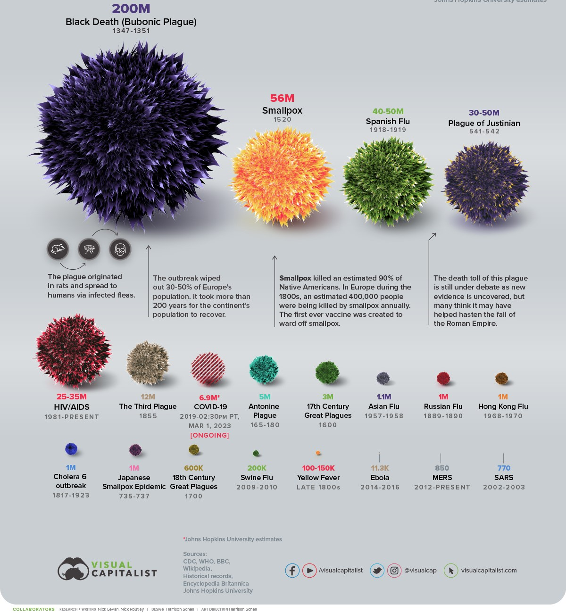

# HISTORICAL PANDEMIC EPIDEMIC DATA ANALYSIS

# INTRODUCTION

Pandemics and epidemics have significantly impacted global health, economies, and societies throughout history. Understanding patterns in disease outbreaks—such as transmission methods, mortality rates, and geographic origins—is essential for improving preparedness and response strategies.
This project analyzes a historical dataset of pandemics and epidemics using SQL to uncover trends, patterns, and insights that can support data-driven public health decisions.

# ABOUT THE DATASET

The dataset contains records of various disease outbreaks across different time periods and regions, including event names, years, estimated cases and deaths, mortality scale, transmission methods, pathogen types, origin regions, and containment strategies.

# DATA VISUALIZATION

The dataset was explored using SQL queries such as filtering, aggregation, grouping, and ranking to extract meaningful insights and patterns.

# PROBLEM STATEMENT

Despite the availability of historical data on pandemics and epidemics, there is limited structured analysis that clearly identifies:

  - The most deadly diseases over time

  - Patterns in transmission methods

  - The effectiveness of containment strategies

  - Trends in mortality and outbreak severity 

Without proper analysis, it becomes difficult for researchers and policymakers to **draw actionable conclusions** from the data. 

This project addresses this gap by applying SQL techniques to analyze and interpret the dataset, providing **clear insights into disease trends and impacts**

# KEY INSIGHT

### ☠️ **Severity of Diseases**

• Some diseases have **extremely high death counts**, categorized as “Extremely High Death Case.”

• Mortality rate analysis shows that **some diseases are highly deadly despite fewer cases**.

### 🌍 **Geographic Patterns** 

* Several diseases originated from specific regions such as **Africa**, highlighting regional vulnerability. 

* Disease spread is influenced by **location and environmental factors**.
  

### 🦠 **Transmission Methods** 

* Certain transmission methods appear more frequently, indicating **common pathways for disease spread**.

* Airborne and contact-based transmissions are likely dominant.
  
  

### 📈 **Trend Over Time** 

* Disease outbreaks span across different years, with some periods showing **higher frequency of pandemics**. 

* Modern outbreaks (post-2000) indicate **continued global health risks**.
  

### 🛡️ **Containment Strategies** 

* Some containment methods are used repeatedly, suggesting **standard global response practices**.

* However, repeated outbreaks imply that **containment effectiveness varies**.
  

### 🎓 **Mortality Classification** 

* Diseases were successfully categorized into:

* Very Low
  
 * Low
    
 * High
      
 * Extremely High

🔍 This helps simplify complex data into **understandable severity levels**.

# RECOMMENDATION
    
# 🏥For Public Health Authorities

* Strengthen monitoring of **high-risk regions**

* Improve **early detection systems** for emerging diseases
   
* Invest in **effective containment strategies** 
 
  
# 🌍 **For Governments & Organizations**

* Promote **global collaboration** in disease control

* Enhance **data collection and sharing systems**

* Focus on **preventive healthcare infrastructure**

 # 📊 **For Researchers & Analysts** 
 
* Use advanced tools (e.g., Python, Power BI) for deeper analysis
 
* Continuously update datasets for real-time insights
 
* Combine **historical and predictive analysis**

# CONCLUSION

The analysis of historical pandemics and epidemics reveals critical insights into disease patterns, severity, and mechanisms of spread. SQL queries enabled effective extraction and interpretation of data, highlighting key trends such as high-mortality diseases, common transmission methods, and recurring containment strategies.

Overall, this study demonstrates the importance of **data analysis in understanding global health challenges** and supports the need for **proactive, data-driven decision-making** in managing future outbreaks.
